# LAB 10 — Installation et Validation de Frida sur Android

## 📌 Objectif du Lab

Ce laboratoire a pour objectif d’installer et configurer Frida afin de réaliser de l’instrumentation dynamique sur un émulateur Android.  
Le lab couvre :

- Installation des outils Frida
- Vérification des versions
- Déploiement de `frida-server`
- Connexion entre le PC et l’émulateur
- Injection d’un script JavaScript
- Exploration des modules mémoire et des bibliothèques natives

---

# 🖼️ Capture 1 — Installation et mise à jour de Frida

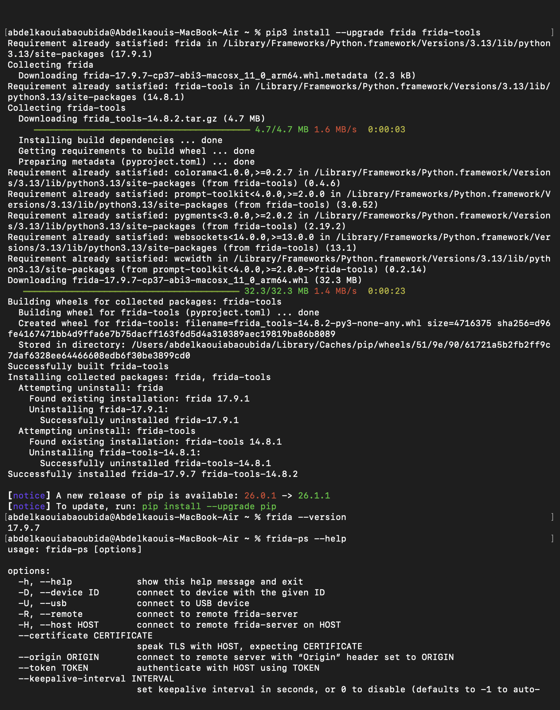

## ✅ Explication

Cette étape montre :

- La mise à jour de `frida` et `frida-tools`
- L’installation réussie des dépendances Python
- La vérification de la version avec :

```bash
frida --version
```

Résultat obtenu :

```bash
17.9.7
```

Puis la commande :

```bash
frida-ps --help
```

affiche les options disponibles de Frida.

### ✔️ Conclusion

Frida est correctement installé sur macOS.

---

# 🖼️ Capture 2 — Vérification de l’architecture Android

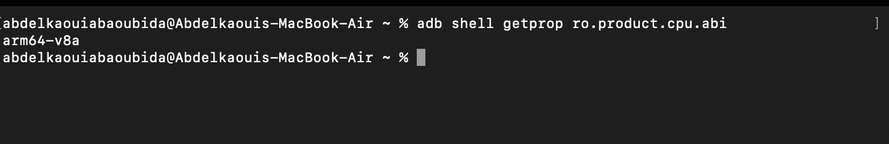

## ✅ Explication

Commande exécutée :

```bash
adb shell getprop ro.product.cpu.abi
```

Résultat :

```bash
arm64-v8a
```

Cette information permet de télécharger la bonne version de `frida-server`.

### ✔️ Conclusion

L’émulateur Android utilise une architecture ARM64.

---

# 🖼️ Capture 3 — Préparation du fichier frida-server

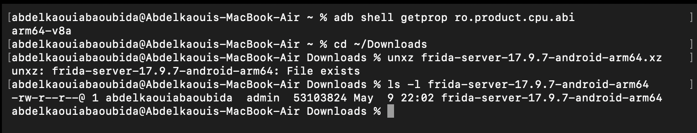

## ✅ Explication

Étapes réalisées :

```bash
cd ~/Downloads
unxz frida-server-17.9.7-android-arm64.xz
```

Puis vérification du fichier :

```bash
ls -l frida-server-17.9.7-android-arm64
```

Le message :

```bash
File exists
```

indique que le fichier avait déjà été extrait.

### ✔️ Conclusion

Le fichier `frida-server` ARM64 est prêt à être déployé.

---

# 🖼️ Capture 4 — Vérification du serveur Frida et redirection des ports

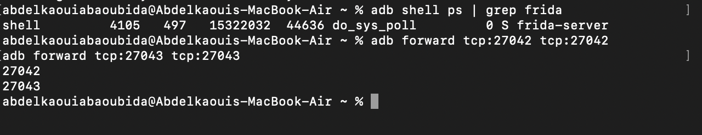

## ✅ Explication

Commande utilisée :

```bash
adb shell ps | grep frida
```

Résultat :

```bash
frida-server
```

Cela confirme que le serveur Frida tourne correctement.

Ensuite :

```bash
adb forward tcp:27042 tcp:27042
adb forward tcp:27043 tcp:27043
```

Ces commandes permettent de rediriger les ports entre le PC et l’émulateur.

### ✔️ Conclusion

La communication entre le client Frida et le serveur Android est correctement configurée.

---

# 🖼️ Capture 5 — Liste des processus Android avec Frida

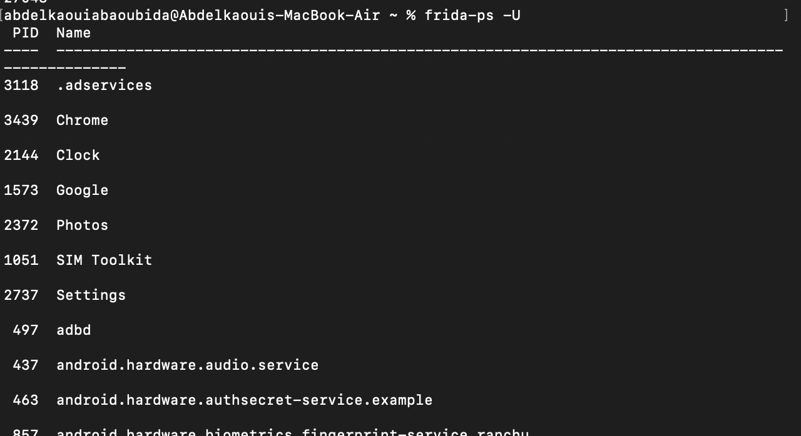

## ✅ Explication

Commande utilisée :

```bash
frida-ps -U
```

Cette commande affiche les processus actifs de l’émulateur Android.

Exemples détectés :

- Chrome
- Clock
- Google
- Photos
- Settings
- adbd

### ✔️ Conclusion

Frida communique correctement avec l’émulateur Android.

---

# 🖼️ Capture 6 — Liste des applications Android installées

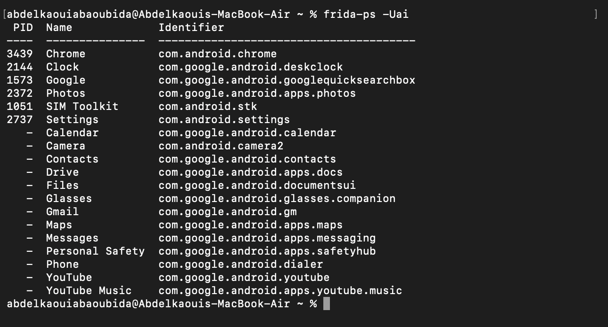

## ✅ Explication

Commande exécutée :

```bash
frida-ps -Uai
```

Options utilisées :

- `-U` → appareil USB/ADB
- `-a` → applications
- `-i` → identifiants des packages

Cette commande affiche :

| Application | Package |
|---|---|
| Chrome | com.android.chrome |
| Settings | com.android.settings |
| Gmail | com.google.android.gm |
| YouTube | com.google.android.youtube |

### ✔️ Conclusion

Frida peut détecter les applications Android installées.

---

# 🖼️ Capture 7 — Création du script hello.js

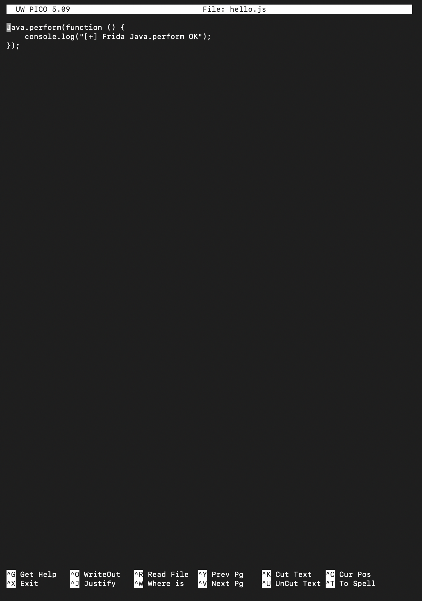

## ✅ Explication

Création du fichier :

```bash
nano hello.js
```

Contenu du script :

```javascript
Java.perform(function () {
    console.log("[+] Frida Java.perform OK");
});
```

Ce script permet de vérifier le fonctionnement de l’API Java de Frida.

### ✔️ Conclusion

Le script d’injection Java a été créé avec succès.

---

# 🖼️ Capture 8 — Injection du script avec Frida

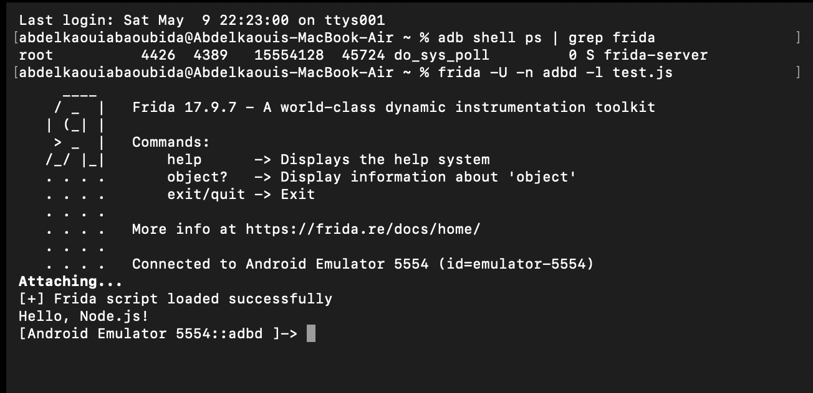

## ✅ Explication

Commande exécutée :

```bash
frida -U -n adbd -l test.js
```

Résultats observés :

```bash
Attaching...
[+] Frida script loaded successfully
Hello, Node.js!
```

Cela confirme :

- l’attachement au processus Android
- le chargement correct du script JavaScript

### ✔️ Conclusion

L’injection Frida fonctionne correctement.

---

# 🖼️ Capture 9 — Exploration des modules Android avec Frida

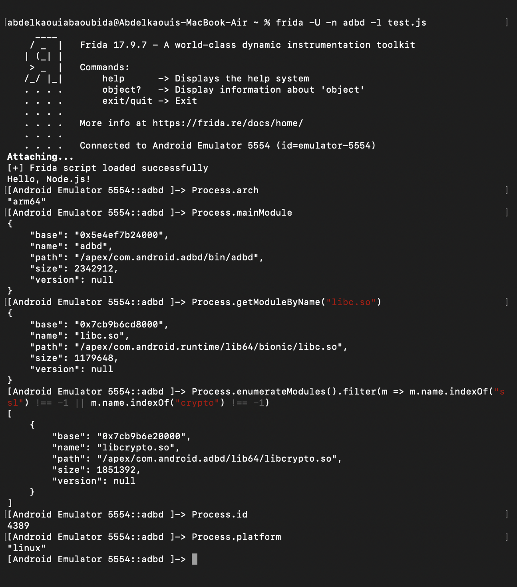

## ✅ Explication

Plusieurs commandes Frida ont été utilisées :

### Architecture du processus

```javascript
Process.arch
```

Résultat :

```javascript
"arm64"
```

### Module principal

```javascript
Process.mainModule
```

### Chargement de libc

```javascript
Process.getModuleByName("libc.so")
```

### Recherche des bibliothèques SSL et Crypto

```javascript
Process.enumerateModules()
```

Résultat :

```javascript
libcrypto.so
```

### Informations système

```javascript
Process.id
Process.platform
```

### ✔️ Conclusion

Frida peut analyser les modules mémoire et bibliothèques natives du processus Android.

---

# 🖼️ Capture 10 — Analyse avancée de la mémoire et des modules

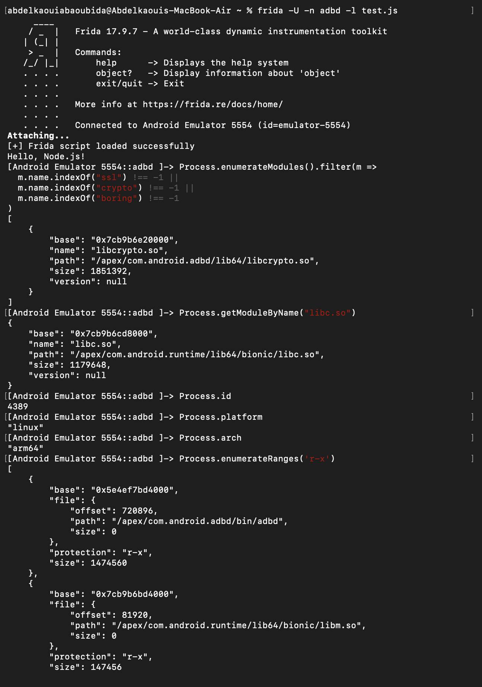

## ✅ Explication

Analyse plus poussée :

### Recherche des modules SSL/Crypto/BoringSSL

```javascript
Process.enumerateModules().filter(...)
```

### Vérification de libc

```javascript
Process.getModuleByName("libc.so")
```

### Analyse des régions mémoire exécutables

```javascript
Process.enumerateRanges('r-x')
```

Cette commande affiche les zones mémoire exécutables du processus.

### ✔️ Conclusion

Frida permet l’exploration avancée de la mémoire du processus Android.

---

# 🖼️ Capture 11 — Vérification de l’environnement Java

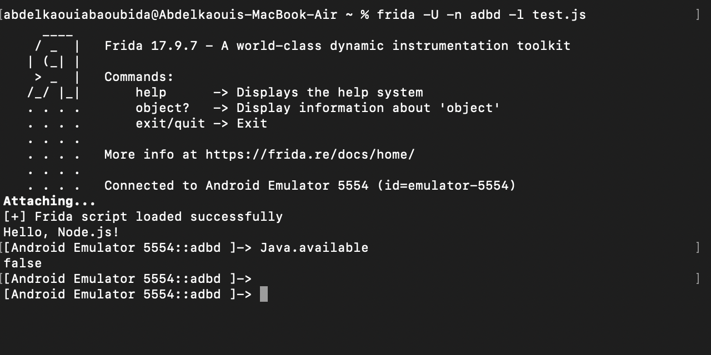

## ✅ Explication

Commande exécutée dans la console Frida :

```javascript
Java.available
```

Résultat :

```javascript
false
```

Cela signifie que le processus `adbd` n’utilise pas la machine virtuelle Java Android.

C’est normal car `adbd` est un processus natif Linux et non une application Android Java.

### ✔️ Conclusion

Le processus analysé fonctionne uniquement avec du code natif.

---

# ✅ Résultat Final du Lab

À la fin de ce laboratoire :

- Frida a été installé correctement
- `frida-server` a été déployé sur Android
- La connexion PC ↔ Android fonctionne
- Les processus Android sont accessibles
- L’injection JavaScript fonctionne
- Les modules natifs et bibliothèques mémoire ont été analysés
- L’environnement Java et natif a été étudié

---

# 🛠️ Outils Utilisés

- Frida 17.9.7
- frida-tools 14.8.2
- Android Emulator
- ADB
- macOS
- Nano Editor

---

# 📚 Commandes importantes utilisées

```bash
frida --version
```

```bash
frida-ps -U
```

```bash
frida-ps -Uai
```

```bash
adb shell getprop ro.product.cpu.abi
```

```bash
adb forward tcp:27042 tcp:27042
```

```bash
frida -U -n adbd -l test.js
```

---

# 👨‍💻 Auteur

- Abdelkaoui Abaoubida
- EMSI — Cybersécurité
- Lab 10 — Frida Installation & Instrumentation
